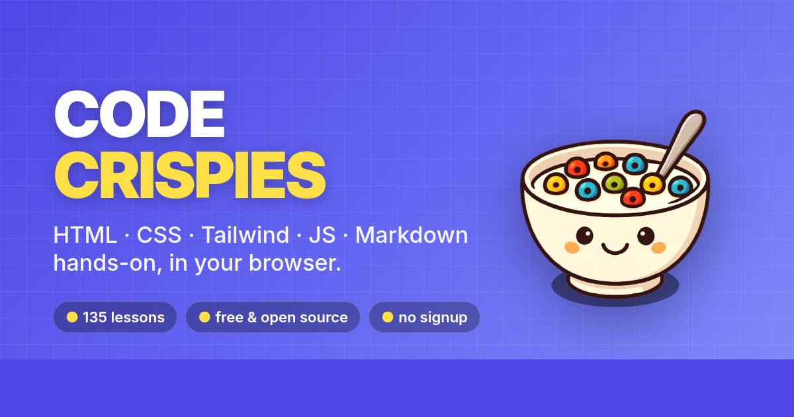
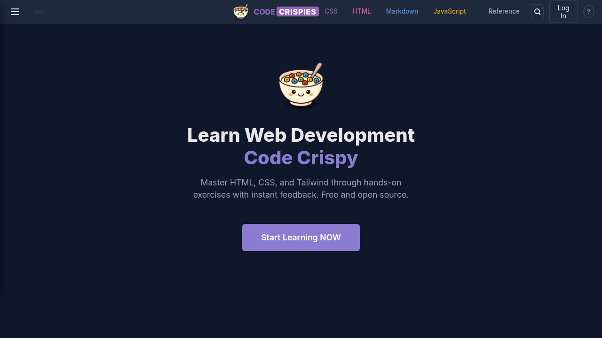
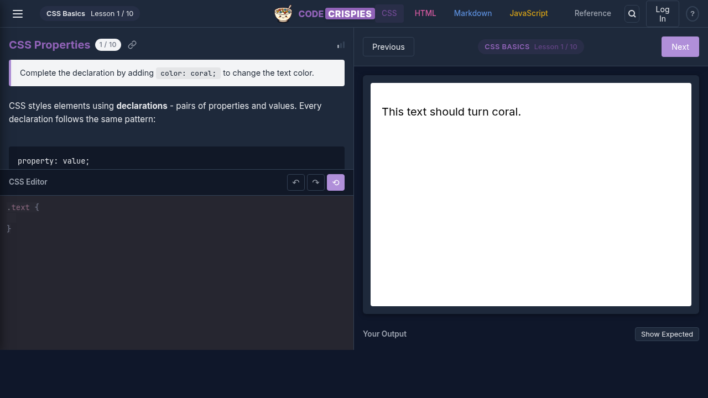
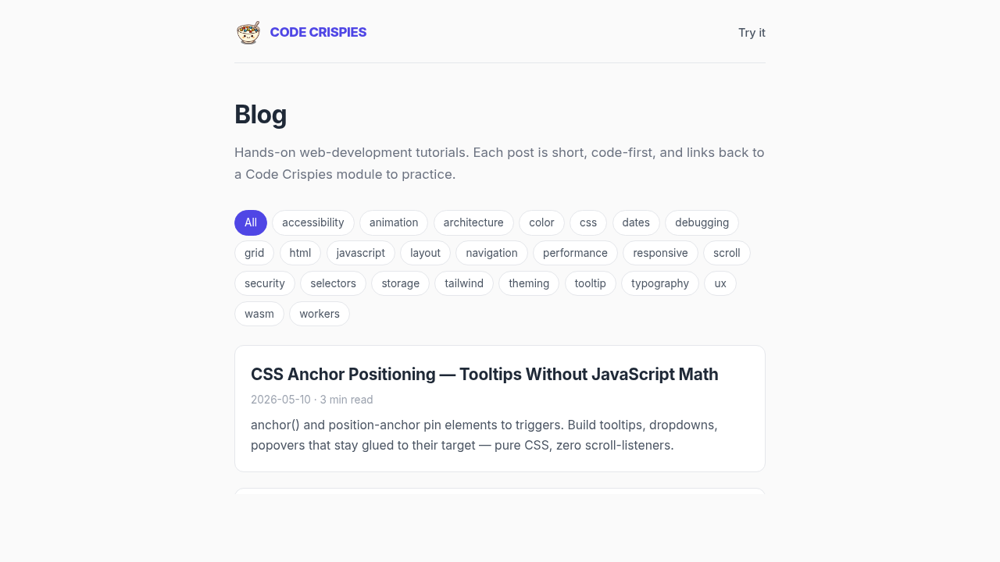

<p align="center">
  <a href="https://codecrispi.es"></a>
</p>

<p align="center">
  <strong>Learn HTML, CSS, Tailwind, JS &amp; Markdown — hands-on, in your browser.</strong>
</p>

<p align="center">
  <a href="https://codecrispi.es"></a>
  <a href="./LICENSE"></a>
  
  
  
</p>

<p align="center">
  <a href="https://codecrispi.es"><strong>▶ Try it live</strong></a>
  ·
  <a href="https://codecrispi.es/blog/">Blog</a>
  ·
  <a href="https://codecrispi.es/blog/rss.xml">RSS</a>
</p>

<p align="center">
  <a href="https://codecrispi.es"></a>
</p>

<table align="center">
  <tr>
    <td align="center">
      <a href="https://codecrispi.es">
        
      </a>
      <br><sub><b>Landing</b></sub>
    </td>
    <td align="center">
      <a href="https://codecrispi.es/css-basic-selectors/0/">
        
      </a>
      <br><sub><b>Lesson editor</b></sub>
    </td>
    <td align="center">
      <a href="https://codecrispi.es/blog/">
        
      </a>
      <br><sub><b>Blog</b></sub>
    </td>
  </tr>
</table>

---

120 progressive lessons across 32 modules covering HTML, CSS, Tailwind, JavaScript, and Markdown. Each lesson is a short coding challenge with live preview and instant validation. No account, no ads, no tracking beyond privacy-friendly Umami. Self-hostable.

## How it compares

| | Free | No signup | Self-host | Live validation | Scope |
|---|:---:|:---:|:---:|:---:|---|
| **Code Crispies** | ✅ | ✅ | ✅ | ✅ | HTML, CSS, Tailwind, JS, Markdown |
| Flexbox Froggy | ✅ | ✅ | ❌ | ✅ | Flexbox only |
| Grid Garden | ✅ | ✅ | ❌ | ✅ | Grid only |
| CSS Diner | ✅ | ✅ | ❌ | ✅ | Selectors only |
| CSSBattle | ✅ | ❌ | ❌ | ✅ | CSS code-golf |
| Frontend Mentor | partial | ❌ | ❌ | manual | Design challenges |
| Scrimba | freemium | ❌ | ❌ | via video | Video courses |
| FreeCodeCamp | ✅ | ❌ | ❌ | ✅ | Long-form curriculum |

Code Crispies is the only option that combines **all five**: free, no signup, self-hostable, live validation, and broad multi-stack scope.

## From the blog

Hands-on tutorials on modern web platform features, each linking to a Code Crispies module to practice:

- [Web Components in 2026 — Finally Worth Using](https://codecrispi.es/blog/web-components-2026-finally-good/)
- [JavaScript Signals — Fine-Grained Reactivity Without a Framework](https://codecrispi.es/blog/signals-fine-grained-reactivity/)
- [The Navigation API — Finally a Sane Router Primitive](https://codecrispi.es/blog/navigation-api/)
- [Speculation Rules — Prerender the Page Before They Click](https://codecrispi.es/blog/speculation-rules-prerender/)
- [@scope — Style Without Naming Things](https://codecrispi.es/blog/css-scope-rule/)
- [Native CSS Nesting — Stop Compiling for Sass-Style Code](https://codecrispi.es/blog/css-nesting-native-no-postcss/)

Browse all at [codecrispi.es/blog](https://codecrispi.es/blog/) · subscribe via [RSS](https://codecrispi.es/blog/rss.xml).

## Local development

```bash
git clone https://github.com/nextlevelshit/code-crispies.git
cd code-crispies
npm i
npm start         # http://localhost:1312
```

Requires Node 18+, npm 8+. `nvm use` if you have it.

### Scripts

| | |
|---|---|
| `npm start` | dev server with host binding |
| `npm run build` | production build → `dist/` |
| `npm run preview` | local preview of prod build |
| `npm run test` | run vitest once |
| `npm run test.watch` | watch mode |
| `npm run test.coverage` | coverage report → `coverage/` |
| `npm run format` | prettier on source |
| `npm run format.lessons` | prettier on lesson JSON |

## Project layout

```
code-crispies/
├── lessons/              # 135 JSON lesson definitions
│   ├── *.json            # English (default)
│   └── ar|de|es|pl|uk/   # localized (partial)
├── public/               # static assets, PWA, og-image, logo
├── schemas/              # JSON Schema for lessons
├── src/
│   ├── config/lessons.js
│   ├── helpers/{renderer,validator}.js
│   ├── impl/LessonEngine.js
│   ├── app.js
│   ├── index.html
│   └── main.css
└── tests/unit/           # vitest
```

## Authoring lessons

Lessons live in `lessons/*.json`, validated against [`schemas/code-crispies-module-schema.json`](./schemas/code-crispies-module-schema.json).

```json
{
  "id": "module-id",
  "title": "Module Title",
  "mode": "css",
  "difficulty": "beginner",
  "lessons": [
    {
      "id": "lesson-id",
      "title": "Lesson Title",
      "task": "What the student must do",
      "previewHTML": "<div>preview markup</div>",
      "initialCode": "/* starting code */",
      "validations": [
        { "type": "property_value", "property": "display", "expected": "flex" }
      ]
    }
  ]
}
```

Validation types: `contains`, `contains_class`, `not_contains`, `regex`, `property_value`, `syntax`, `custom`.

For Tailwind mode, `{{USER_CLASSES}}` in `previewHTML` is replaced with student input.

## Deployment

`npm run build` → `dist/`. Deploy to any static web server (nginx, caddy, GitHub Pages, Netlify, Vercel, S3+CloudFront).

Live deploy at [codecrispi.es](https://codecrispi.es) runs on a single nginx container, alias of `cc.cloud.librete.ch`.

The build also emits per-lesson static HTML pages with structured data + a sitemap (185 URLs), so all content is crawlable without JS.

## Internationalization

Lessons available in `lessons/*.json` (English default) and partial translations in `ar`, `de`, `es`, `pl`, `uk`. Docs in `docs/` (English + German).

## Contributing

1. Fork
2. Branch off `main`
3. `npm run format` + `npm run format.lessons`
4. `npm run test`
5. Open PR

## License

[MIT](./LICENSE) — © 2026 Michael Czechowski.
